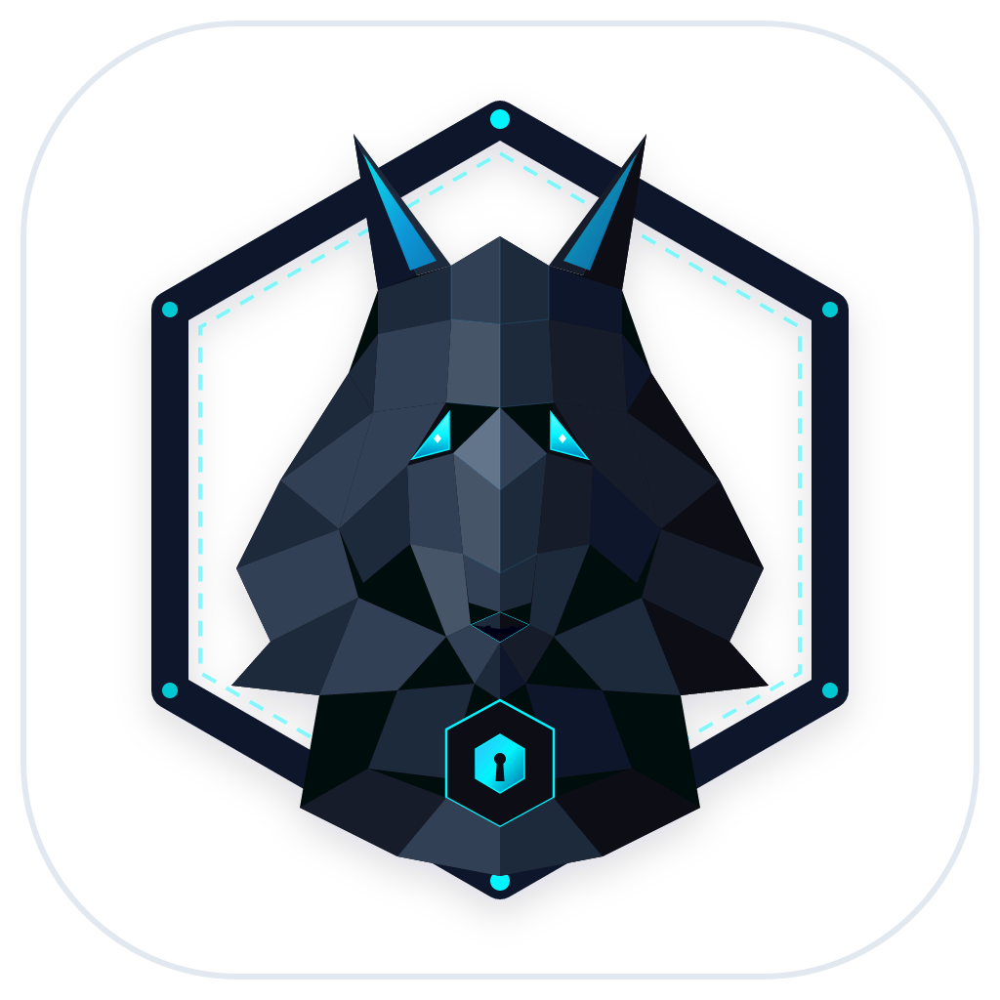
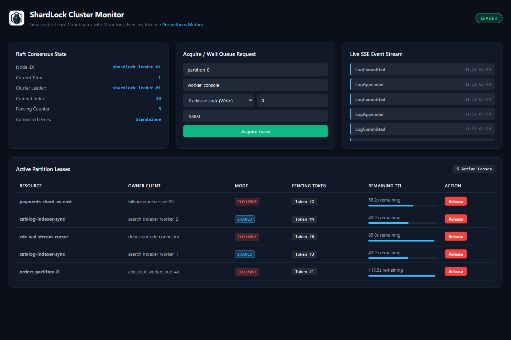

<p align="center">
  
</p>

<h1 align="center">ShardLock</h1>

<p align="center">
  <strong>Distributed consensus daemon and monotonic partition lease coordinator</strong><br>
  Built on Java 21 LTS Virtual Threads, Raft-Lite consensus, and monotonic fencing tokens.
</p>

<p align="center">
  <a href="https://github.com/alexandrmotologa/shardlock/actions"></a>
  <a href="#license"></a>
  
  
</p>

ShardLock is a distributed consensus daemon and partition lease coordinator written in Java 21 LTS. It uses a lightweight implementation of the Raft consensus algorithm to provide linearized locks and monotonic fencing tokens across a cluster.

## Why ShardLock exists

Distributed workers that process partitioned jobs (such as message queue consumers, stream partitions, or scheduled task runners) require mutual exclusion. When two workers believe they own the same partition simultaneously, data corruption occurs.

Common approaches have practical trade-offs:
- ZooKeeper and Consul carry heavy operational requirements, complex setup, and large deployment footprints.
- Redis-based algorithms like Redlock rely on system clock synchronization. If a worker pauses during garbage collection or network delay, its lock can expire while the worker still executes, allowing a second worker to acquire the lock and cause split-brain writes.

ShardLock addresses this by pairing Raft consensus with monotonic fencing tokens. Every lease granted by the leader carries a strictly increasing 64-bit integer token. Storage layers use this token to reject writes from workers that suffered an unnoticed pause.

## Key capabilities

- Pure Raft consensus: Implements leader election, log replication, safety invariants, and commit index tracking.
- Pre-Vote Protocol (Raft §9.6): Non-binding pre-candidate checks eliminate disruptive election cycles caused by partitioned or lagged nodes.
- ReadIndex Linearizable Reads: Leader satisfies read queries by confirming consensus through a heartbeat round without appending new entries to the log.
- Shared and Exclusive Locks: Supports concurrent shared read leases alongside exclusive write locks for reader-writer coordination.
- Lock Wait Queue & Long-Polling: Contestants can wait in FIFO queue using `waitTimeoutMs` and are woken up immediately when the lease frees up.
- Monotonic fencing tokens: Every lock acquisition increments a persistent cluster counter. Downstream stores can compare tokens on writes to reject stale updates.
- Ephemeral client sessions: Leases expire automatically if a client fails to send periodic renewal heartbeats.
- Write-Ahead Log (WAL) with Auto-Compaction: Log entries persist to disk with CRC32 checksums, length framing, and background snapshot rotation.
- Prometheus Metrics: Exposes OpenMetrics / Prometheus metrics at `/metrics` for cluster monitoring.
- Zero external framework runtime: Built with core Java 21 features, including Virtual Threads and the standard HTTP server.
- Embedded live dashboard: A single-page web monitor served directly by each node, showing cluster topology, SSE real-time event timeline, node roles, wait queue lengths, and active leases.

## Architecture

ShardLock follows hexagonal architecture:

- `domain`: Pure Java 21 model and state machine. It has zero external dependencies.
- `application`: Orchestration services for consensus, lock coordination, wait queue handling, and session management.
- `infrastructure`: Adapters for TCP network transport, disk storage (WAL and snapshots), and embedded HTTP endpoints.

For details, read [docs/architecture.md](docs/architecture.md).

## Quick start

### Prerequisites

- Java 21 LTS
- Maven 3.9+

### Build

```bash
mvn clean package
```

### Running a 3-node cluster locally

Start node 1 (HTTP port 8001, peer port 9001):
```bash
java -jar shardlock-core/target/shardlock-core-1.0.0-SNAPSHOT.jar \
  --node-id=node-1 \
  --http-port=8001 \
  --peer-port=9001 \
  --peers=node-1:127.0.0.1:9001,node-2:127.0.0.1:9002,node-3:127.0.0.1:9003 \
  --data-dir=./data/node-1
```

Start node 2 (HTTP port 8002, peer port 9002):
```bash
java -jar shardlock-core/target/shardlock-core-1.0.0-SNAPSHOT.jar \
  --node-id=node-2 \
  --http-port=8002 \
  --peer-port=9002 \
  --peers=node-1:127.0.0.1:9001,node-2:127.0.0.1:9002,node-3:127.0.0.1:9003 \
  --data-dir=./data/node-2
```

Start node 3 (HTTP port 8003, peer port 9003):
```bash
java -jar shardlock-core/target/shardlock-core-1.0.0-SNAPSHOT.jar \
  --node-id=node-3 \
  --http-port=8003 \
  --peer-port=9003 \
  --peers=node-1:127.0.0.1:9001,node-2:127.0.0.1:9002,node-3:127.0.0.1:9003 \
  --data-dir=./data/node-3
```

## Live Dashboard & Observability
 
Each node serves an embedded, zero-dependency visualizer running on Java 21 Virtual Threads with Server-Sent Events (SSE). It gives real-time visibility into Raft topology, leadership terms, active exclusive and shared partition leases, monotonic fencing tokens, and replication event logs:

<p align="center">
  
</p>

Open `http://localhost:8001` in your browser to inspect the cluster visualizer.

## REST API & Observability

### Check cluster status

```bash
curl -s http://localhost:8001/api/v1/cluster/status
```

### Prometheus Metrics

```bash
curl -s http://localhost:8001/metrics
```

### Acquire an exclusive or shared lock with optional wait timeout

```bash
curl -X POST http://localhost:8001/api/v1/locks/acquire \
  -H "Content-Type: application/json" \
  -d '{"resource": "partition-orders-0", "clientId": "worker-a", "mode": "EXCLUSIVE", "waitTimeoutMs": 5000, "ttlMs": 10000}'
```

Response:
```json
{
  "status": "ACQUIRED",
  "resource": "partition-orders-0",
  "clientId": "worker-a",
  "fencingToken": 101,
  "expiresAtMs": 1773349200000,
  "ttlMs": 10000,
  "mode": "EXCLUSIVE"
}
```

### Renew a lock

```bash
curl -X POST http://localhost:8001/api/v1/locks/renew \
  -H "Content-Type: application/json" \
  -d '{"resource": "partition-orders-0", "clientId": "worker-a", "fencingToken": 101, "ttlMs": 10000}'
```

### Release a lock

```bash
curl -X POST http://localhost:8001/api/v1/locks/release \
  -H "Content-Type: application/json" \
  -d '{"resource": "partition-orders-0", "clientId": "worker-a", "fencingToken": 101}'
```

## Standalone CLI Tool

Use `ShardLockCli` for terminal management:

```bash
# Check cluster status
java -cp shardlock-client/target/shardlock-client-1.0.0-SNAPSHOT.jar com.engine.shardlock.client.cli.ShardLockCli status

# Acquire lease with 5-second wait queue long-polling
java -cp shardlock-client/target/shardlock-client-1.0.0-SNAPSHOT.jar com.engine.shardlock.client.cli.ShardLockCli acquire orders-0 10000 5000 EXCLUSIVE

# List all active leases
java -cp shardlock-client/target/shardlock-client-1.0.0-SNAPSHOT.jar com.engine.shardlock.client.cli.ShardLockCli list
```

## Java Client Example

```java
ShardLockClient client = ShardLockClient.builder()
    .endpoints(List.of("http://localhost:8001", "http://localhost:8002", "http://localhost:8003"))
    .clientId("worker-a")
    .build();

// Automatically acquires, heartbeats in the background, and releases
client.tryWithLock("orders-partition-0", Duration.ofSeconds(10), lockHandle -> {
    long token = lockHandle.fencingToken();
    storageService.writeWithToken("orders-partition-0", payload, token);
});
```

## Downstream SQL Fencing Guard (Martin Kleppmann GC Pause Defense)

```sql
UPDATE partition_state 
SET payload = ?, fencing_token = ? 
WHERE partition_id = ? AND fencing_token < ?;
```

If a worker experiences an unexpected stop-the-world GC pause and attempts to write with an older token, the query affects 0 rows, preventing split-brain state corruption. See `PostgresFencingGuardSample.java` for a complete working demonstration.

## License

MIT License. See [LICENSE](LICENSE) for details.
